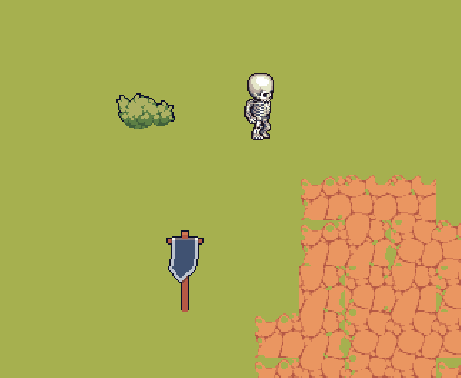
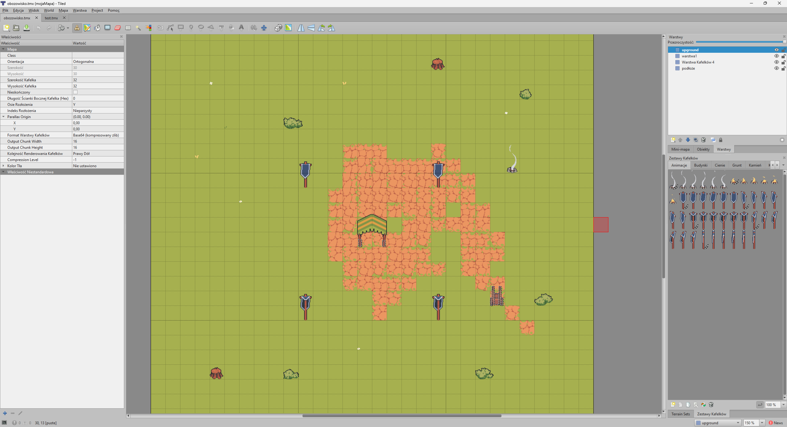

# 2D Game Engine - Complete Tiled Map Parser with Animations

This project solves a real problem that everyone faces when trying to use Tiled Map Editor in professional projects: **the code generated by Tiled is simply too basic and limited**.

While Tiled offers an excellent editor, its export provides only raw data - without a real animation system, without advanced hitboxes, without dynamic rendering. This engine fills that gap.

## What this engine actually does:

**Instead of just loading PNGs:**
- Reads animation definitions directly from TMX files (each frame with its own duration)
- Automatically configures flipping, rotations and tile transformations
- Parses compressed map layers (Base64 + zlib) instead of simple CSV

**Instead of manually setting collisions:**
- Extracts hitboxes directly from Tiled - rectangles, circles, polygons, points
- Maintains precise positioning defined in the editor
- Automatically assigns collisions to appropriate tiles

**Instead of static textures:**
- Dynamic canvas textures that update only changed areas
- Independent animation timelines for each animated tile
- Smooth transitions based on deltaTime rather than fixed intervals

## How it works in practice:

You create maps in Tiled as usual - add animations, set hitboxes, define layers. But instead of using their limited export, you load the map directly into this engine.

The engine automatically:
- Recognizes which tiles are animated and configures their sequences
- Extracts all collisions and transformations
- Builds an optimal multi-layer rendering system
- Sets up a camera that smoothly follows the character

## Tiled Integration Example

*Seamless integration between Tiled Editor and the game engine*

## Who this project is for:

For anyone who wants to use Tiled not as a simple map editor, but as a full-fledged game development tool. This isn't another SFML "hello world" - it's a complete solution that turns TMX files into a working game engine.

**Technologies:** C++17, SFML, TMXLite, pugixml, zlib

---

This isn't another basic implementation - it's a solution to a real problem that affects every developer using Tiled Map Editor in serious projects.
